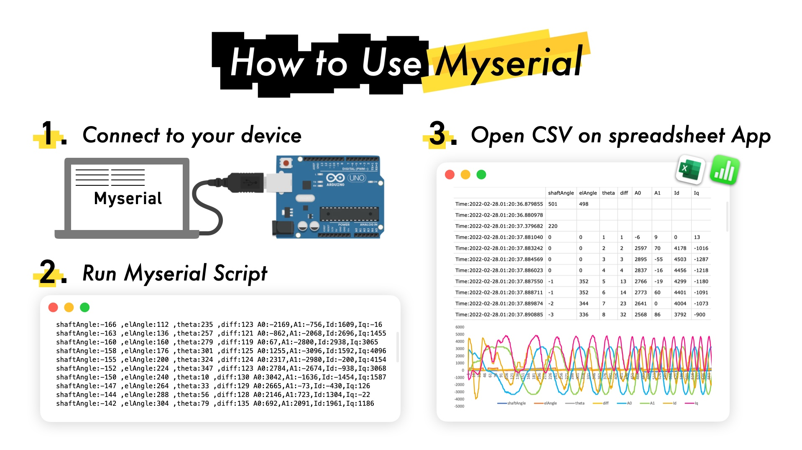

# MySerial
Serial Debugger based on by pyserial.

## What is this python script?
This program is a part of my study of python.
It is developed through editing ` pyserial` [example](https://github.com/pyserial/pyserial/blob/master/serial/tools/miniterm.py).
Using with python lancher is recommended.

## Usage
Usage is quite simple. Probably you wouldn't need this instruction but just in case.

### Step0. Call this script

~~~bash
$ python Myserial.py
~~~

### Step1. Specify serial port which you'd like to connect.

The prompt shows several options. Find your device and specify one of them by entering index number or its name. 

### Step2. Set Baudrate
After Step1,the prompt asks the baudrate which you'd like to use.
Enter the baudrate numbers. 
e,g `9600` `19200` `38400` `57600` `74880` `115200` `230400` ...

**Enjoy Monitoring :)**

### Requiremants
- Python3
- pyserial

# Myserialというツールを作った
### Myserialとは？
Myserialは僕がpythonの勉強のために作ったスクリプトです。シリアルモニターのスクリプトです。pyserialベースで作られています。

### 特徴
* pythonで書かれている
* pyserialベース
* bin(2進数)
* oct(8進数)
* dec(10進数)
* hex(16進数)に対応
* baud rateの指定

### なぜ作ったのか
普段はArduinoIDEのシリアルモニターかMacに標準で入っているscreenコマンド(termnal.appで動くやつ)を使ってシリアルモニターを使っています。ArduinoIDEのシリアルモニターは無料で手に入り、バッファも大きくて安定しています。しかしArduinoIDEを開くのにはかなり時間がかかり、マイコンにプログラムを書き込みながらシリアルモニターを使うと文字化けしてしまいArduinoIDEが落ちてしまうという残念なポイントがありました。screenコマンドを使えば無料かつ安定しているので最高なのですが、usbmodemから始まるポート名を毎回入力しなければならない上に、シリアルモニターを終了するときはバツで消すのではなくて、`:quit`をする必要があるので急いでいる時には不便。RoboCupの大会中にシリアルモニターでデバッグしたりするのですが、それが毎回となるとちょっとめんどくさいと思ったので今回Myserialを作りました。

### 使い方
1. pythonをダウンロードします。
2. pyserial(ライブラリ)をダウンロードします
3. threading(ライブラリ)をダウンロードします
4. Python LancherでMyserial.pyを起動します。
5. シリアルポートに番号が振られるので選択します
6. ボーレートを入力します
7. フォーマット(bin,oct,hex,dec)を選択します
8. シリアルモニター開始

## 動作環境
-python
-python3
## LICENCE 
 MIT. See [LICENCE](./LICENCE)
 
