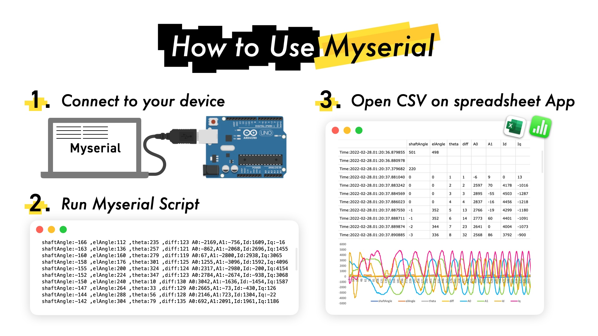
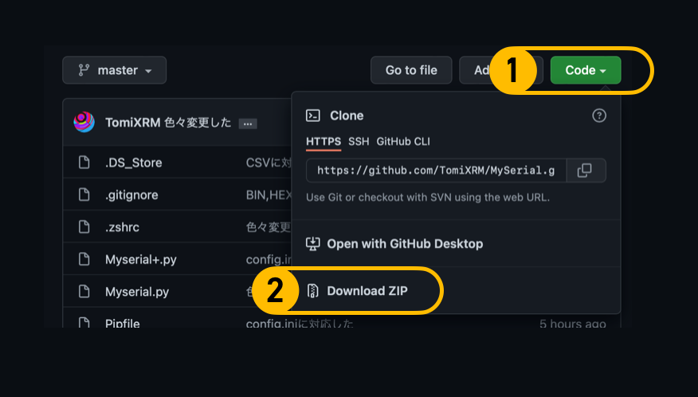
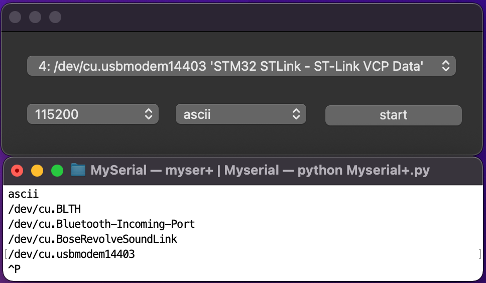
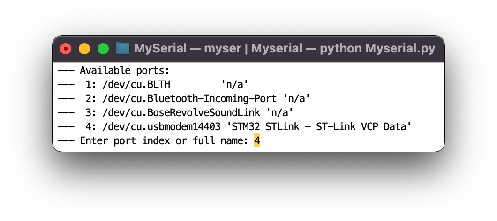
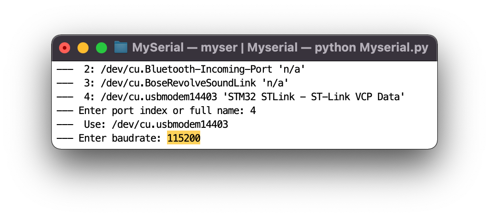

# Myserial

コンセプトは**自由にカスタマイズできる自分だけのシリアルデバッガ**です。

Pythonが動けばWindows・Mac・Ubuntuなどどこでも動きます。

# Usecase Sample



ライブラリに応じてMITライセンスになっています。

⚠️ 動作環境は **python3** です。Python3環境構築をしたことがない人はこちらを参考に

- [Mac](https://prog-8.com/docs/python-env)
- [Windows](https://prog-8.com/docs/python-env-win)

# できること

- CSV出力
- グラフ出力
- 進数出力(e,g 2進数,16進数...)


# How to install

使い方はいたってシンプルです。おそらく、この説明は必要ないと思いますが念のため。

1. **ダウンロード**
2. **必要なライブラリのインストール**
3. **Myserialの実行**

## Step1 ダウンロード

Zip形式でダウンロードできます。

GitHub CLIを使う場合は`gh repo clone TomiXRM/MySerial`



## Step2 ライブラリのインストール

`cd {ダウンロードしたファイルのディレクトリ}`をしてから次のコマンドを実行します

```bash
pip install -r requirements.txt
```

<details>
<summary>インストールされるライブラリ / Requirements</summary>

- pyserial
- pyqtgraph
- numpy
- pandas
- PyQt6


</details>
## Step3 Myserialの実行

以下のコマンドでMyserialが実行されます

```bash
python Myserial.py
```

GUIのMyserial+の場合

```bash
python Myserial+.py
```

# ✨How to use Myserial+

シェルを立ち上げ、pythonファイルのあるディレクトリ内で以下のコマンドを実行します

```bash
python Myserial+.py
```

- 実行すると以下のようなGUIアプリケーションが立ち上がります。
- 下の白いのはシェルです。ここに文字列が出力されます



## 諸々の設定

## 接続先のポートの指定


## フォーマットの指定

以下のフォーマットに対応しています

- ascii(デフォルトの文字列)
- **bin** (バイナリ)
- **oct** (８進数)
- **dec** (10進数)
- **hex** (16進数)
- **csv** (CSV出力)
- **csv+** (CSV出力+グラフ表示)


## ボーレートの指定


# ✨How to use Myserial

基本的には以下のコマンドで実行します

```bash
python Myserial.py
```

## 接続ポートの指定

- 接続可能なポートが番号と名前で表示が出ます
- `番号`または`接続するポート名`を入力してReturn(またはEnter)を押してください



## ボーレートの指定

`Enter baudrate:`と出るので続けてボーレートを入力してください

e,g 9600,19200,38400,57600,115200,230400...



## 出力フォーマットの変更

以下のフォーマットに対応しています

- ascii(デフォルトの文字列)
- **bin** (バイナリ)
- **oct** (８進数)
- **dec** (10進数)
- **hex** (16進数)
- **csv** (CSV出力)
- **csv+** (CSV出力+グラフ表示)

### **csvフォーマットで実行する場合**

```bash
python Myserial.py csv
```

### **binフォーマットで実行する場合**

```bash
python Myserial.py bin
```

# Advanced 上級者向け

## デフォルトパラメータの指定

- `config.ini`をいじることでパラメータを変更できます
- `:` でも `=`でも同じ意味です

```
# baud
#シリアル通信のボーレート
# 4800, 7200, 9600, 14400,19200, 28800, 38400, 57600, 76800, 115200, 230400, 460800, 921600, 1000000, 2000000, 4000000

# port
# デフォルトの接続先

# fmt
# bin, oct, dec, hex, csv, csv+, ascii から選べます
# csv+とcsvの違いは閉じた後にグラフを表示するかどうかです

# directory
# CSVデータの保存先です。絶対パスですることをおすすめします

# fileName
# csvファイルの名前です。ファイル名に時間情報が追加されます。

[Serial]
baud = 115200
port = /dev/cu.usbmodem14403
fmt = ascii

[CSV]
directory : ./LogData/
fileName  : datalog
```

## コマンドの省略

**毎回`python Myserial.py`を実行するのは面倒ですよね**

どうせなら短い言葉で呼び出したいです！

1. **Myserialのフォルダ**をホームディレクトリに配置します
2. `.bashrc`や`.zshrc`がない場合はホームディレクトリに作成してください
    
    
    

1. 以下のテキストを`.zshrc` / `.bashrc`にペーストしましょう。

   - `alias`を使ってコマンドを省略できます。
   - 
2. `myser csv+`のようにすると`python Myserial.py csv+`を実行できます

```
# Myserialを実行するエイリアス
alias myser='cd Myserial
python Myserial.py
cd'

# Myserialを実行するエイリアス
alias myser+='cd Myserial
python Myserial+.py
cd'
```

# **動作環境**

- python3

# **LICENCE**

MIT. See [LICENCE](https://github.com/TomiXRM/MySerial/blob/master/LICENCE)